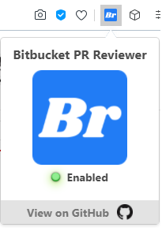
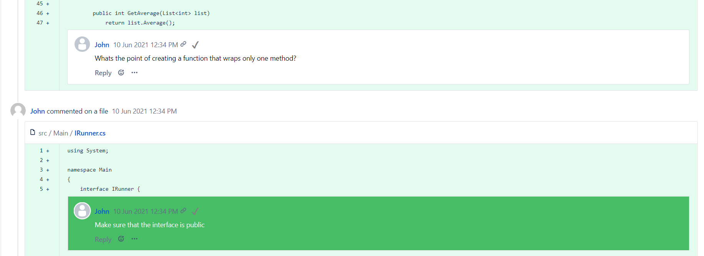

# Bitbucket-PR-Reviewer
Review Pull Requests Comments Status on Bitbucket
https://addons.opera.com/en/extensions/details/bitbucket-pr-reviewer

**Bitbucket lacks the possibility to mark comments as read, which is very annoying because the developer has to remember which comments were reviewed and which weren't.
This chromium addon adds a possibility to mark comments as read. It works locally and doesn't store any data, which means that after page refresh the review status will reset.**

# Popup Main Window

# PR Review Comments 

